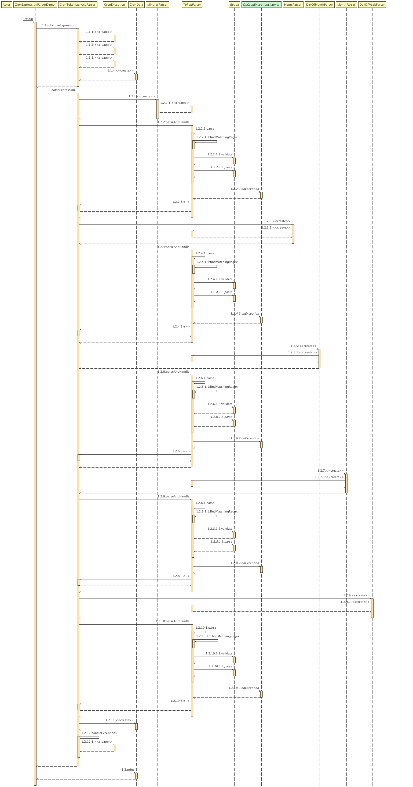

Cron Expression Parser

This simple Java application will tokenize and pars a cron expression and print it in a tabular format.

Prerequisites
Before running this project, ensure you have the following installed:

* Java Development Kit (JDK) 17 or later
* Apache Maven 3.6.0 or later
* Configure mvn and java in PATH variables




Getting Started :

Follow these steps to run the project on linux/macOS.

1. Download the Project
   Download the project folder and navigate to project root folder "CronExpressionParser" in command prompt/terminal

`cd CronExParser`

2. Build the Project using Maven. This will compile the source code and package it into a JAR file.

```mvn clean package```

3. To run the project on Linux or macOS:

```java -cp target/CronExpressionParser-1.0-SNAPSHOT.jar com.deliveroo.renuka.CronExpressionParserDemo "*/15 0 1,15 * 1-5 /usr/bin/find"```

4. Example Output
   When you run the CronExpressionParserDemo class, you should see output similar to this:

```minute         0 15 30 45
hour           0
day of month   1 15
month          1 2 3 4 5 6 7 8 9 10 11 12
day of week    1 2 3 4 5
command        /usr/bin/find```


